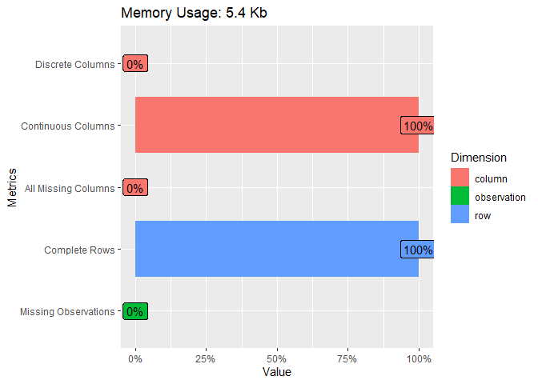
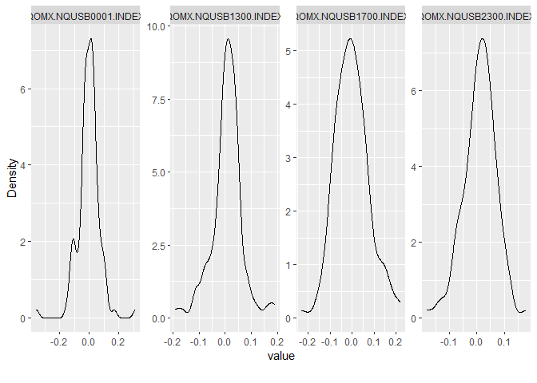
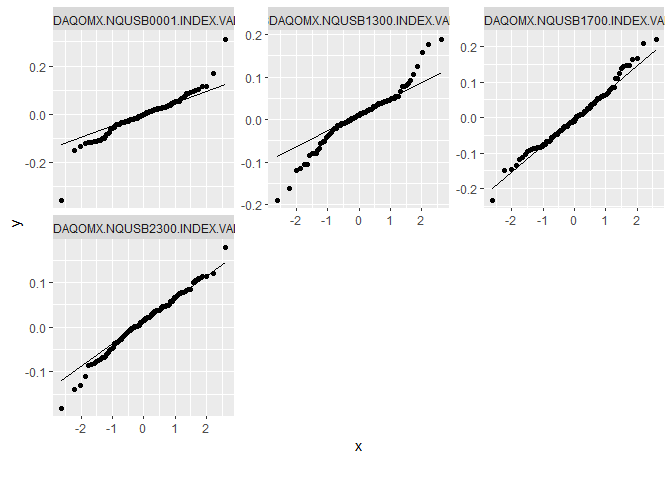
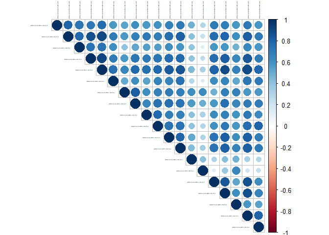
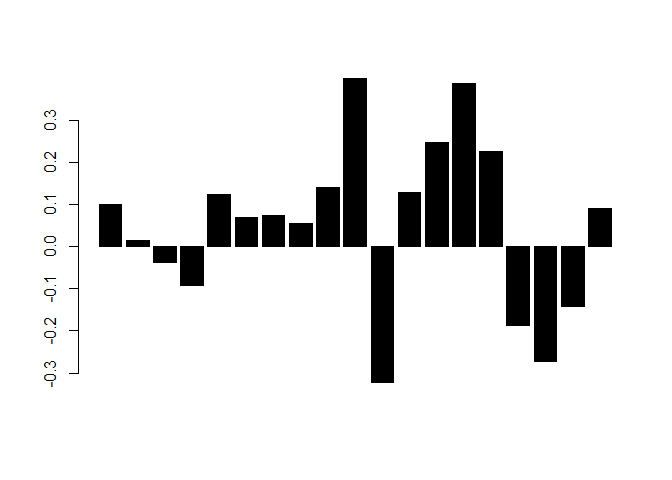
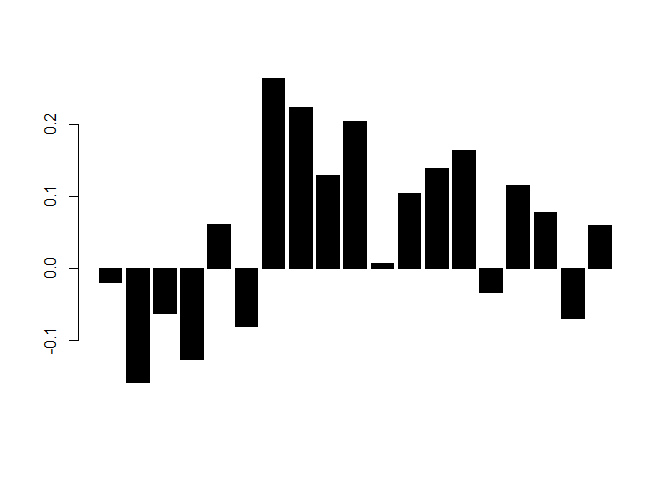
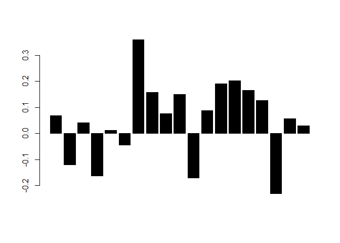

Workshop 1 - Equity portfolio choice, Global Minimum Variance portfolio
and factor models
================
Pierre Clauss
October 2023

*The following R Markdown document has to be read with my course notes
(in particular for the details of the analysis framework).*

*Not all the R codes are displayed but only some of them to help you to
succeed the workshop.*

## Foreword

To begin these workshops, I have to precise the 3 necessary steps for a
data science project:

1.  data: (i) importation, (ii) wrangling and (iii) visualisation (or
    named also *exploratory data analysis*)
2.  modelling
3.  results communication

To achieve these 3 steps, the universe of the package **tidyverse** is
essential for R nowadays.

``` r
library(tidyverse)
```

The first step on data seems often a thankless task but it takes time
(we can estimate it to more than 50% of a data science project) and it
is essential for the success of the project.

The second step is the most grateful for a data scientist. But it is
important to know that the first step and the second one are overlapped:
indeed, when I wrangle or I visualise my data, I often have an idea of
the models I will try.

Finally, the third step is often neglected to a simple ppt, word or tex
document. But it has to be more appreciated with the new tools and this
example of R Markdown document and github website is an attempt to show
you how to communicate better the results of a data science project.

## 1 Data

### 1.1 Importation

I import the data with the package **readxl**, which manages Excel files
very well (comma, percentages) as well as missing values, with the
function `read_xlsx()`.

``` r
library(readxl)
(workshop1 <- read_xlsx("data.xlsx", sheet = "workshop1", skip = 4))
```

    ## # A tibble: 112 × 20
    ##    `TRADE DATE`        `NASDAQOMX/NQUSB0001/INDEX VALUE` NASDAQOMX/NQUSB1300/I…¹
    ##    <dttm>                                          <dbl>                   <dbl>
    ##  1 2011-06-30 00:00:00                          -0.0191                 -0.00444
    ##  2 2011-07-31 00:00:00                           0.00813                -0.0304 
    ##  3 2011-08-31 00:00:00                          -0.102                  -0.0805 
    ##  4 2011-09-30 00:00:00                          -0.123                  -0.163  
    ##  5 2011-10-31 00:00:00                           0.169                   0.176  
    ##  6 2011-11-30 00:00:00                           0.0181                 -0.00764
    ##  7 2011-12-31 00:00:00                          -0.00375                -0.00251
    ##  8 2012-01-31 00:00:00                           0.00943                 0.107  
    ##  9 2012-02-29 00:00:00                           0.0611                  0.0175 
    ## 10 2012-03-31 00:00:00                          -0.0289                  0.0230 
    ## # ℹ 102 more rows
    ## # ℹ abbreviated name: ¹​`NASDAQOMX/NQUSB1300/INDEX VALUE`
    ## # ℹ 17 more variables: `NASDAQOMX/NQUSB1700/INDEX VALUE` <dbl>,
    ## #   `NASDAQOMX/NQUSB2300/INDEX VALUE` <dbl>,
    ## #   `NASDAQOMX/NQUSB2700/INDEX VALUE` <dbl>,
    ## #   `NASDAQOMX/NQUSB3300/INDEX VALUE` <dbl>,
    ## #   `NASDAQOMX/NQUSB3500/INDEX VALUE` <dbl>, …

The data are issued from Quandl and its [Excel
add-in](https://www.quandl.com/tools/excel). You can see the file in the
repo and can focus on the function *=QSERIES(Sector_1 : Sector_19 ;
Start_date : End_date ; “monthly” ; “asc” ; “rdiff”)*.

Data are a sample of monthly stocks returns from Nasdaq observed on 19
US Supersectors from [Industry Classification
Benchmark](https://en.wikipedia.org/wiki/Industry_Classification_Benchmark).
The start date is 30th June 2011 until today.

### 1.2 Wrangling

The wrangling (*démêlage* in French) consists in the storage and the
transformation of the data. “Tidying and transforming are called
**wrangling**, because getting your data in a form that’s natural to
work with often feels like a fight” [R for Data
Science](https://r4ds.had.co.nz/introduction.html) (Grolemund G. and
Wickham H.).

I need for the workshop only returns to do calculation on: so I shrink
the data of workshop 1 to returns.

``` r
fin_return <- workshop1 %>% select(-"TRADE DATE")
```

Then, the wrangling is quite simple here and is essentially done via
data importation in Excel: data are tidy - each column is a variable (a
Supersector) and each line is an observation (a month) - and data are
transformed in financial returns, which are used to model a portfolio.
As I said just before, data and modelling steps are effectively
overlapped.

I can confirm this relation between the two steps with the choice of
monthly observations. Indeed, monthly returns are nearer to gaussian
data than weekly and daily data: they present less extreme variations
(see next section on data viz). As theoretical framework of H. Markowitz
behaves well with gaussian data, this choice is relevant.

To simplify our communication of results, I focus on the 4 first
variables.

``` r
(fin_return_4first_Supersectors <- fin_return %>% select(1:4))
```

    ## # A tibble: 112 × 4
    ##    NASDAQOMX/NQUSB0001/INDEX VAL…¹ NASDAQOMX/NQUSB1300/…² NASDAQOMX/NQUSB1700/…³
    ##                              <dbl>                  <dbl>                  <dbl>
    ##  1                        -0.0191                -0.00444               -0.0239 
    ##  2                         0.00813               -0.0304                -0.0135 
    ##  3                        -0.102                 -0.0805                -0.0875 
    ##  4                        -0.123                 -0.163                 -0.232  
    ##  5                         0.169                  0.176                  0.209  
    ##  6                         0.0181                -0.00764               -0.00442
    ##  7                        -0.00375               -0.00251               -0.0836 
    ##  8                         0.00943                0.107                  0.110  
    ##  9                         0.0611                 0.0175                -0.0340 
    ## 10                        -0.0289                 0.0230                -0.0569 
    ## # ℹ 102 more rows
    ## # ℹ abbreviated names: ¹​`NASDAQOMX/NQUSB0001/INDEX VALUE`,
    ## #   ²​`NASDAQOMX/NQUSB1300/INDEX VALUE`, ³​`NASDAQOMX/NQUSB1700/INDEX VALUE`
    ## # ℹ 1 more variable: `NASDAQOMX/NQUSB2300/INDEX VALUE` <dbl>

We can see below, thanks to the package **DataExplorer**, a summary of
the tidy data observed for the first 4 variables.

``` r
library(DataExplorer)
plot_intro(fin_return_4first_Supersectors)
```

<!-- -->

I can conclude that data are tidy without missing values.

### 1.3 Visualisation

Data viz has to be thought in relation with modelling. We have just seen
that the modelling framework needs gaussian data; it needs also not
perfectly correlated data. Then, I am interested by visualising the
distribution of the returns and the structure of the correlations
between them.

Some statistics to sum up the distribution can be shown below: I can
observe symmetric data with a median and a mean which are quite equal.
This is even a quite perfect case for the fourth variable.

``` r
summary(fin_return_4first_Supersectors)
```

    ##  NASDAQOMX/NQUSB0001/INDEX VALUE NASDAQOMX/NQUSB1300/INDEX VALUE
    ##  Min.   :-0.356795               Min.   :-0.189542              
    ##  1st Qu.:-0.035141               1st Qu.:-0.013827              
    ##  Median :-0.001878               Median : 0.010138              
    ##  Mean   :-0.004631               Mean   : 0.006858              
    ##  3rd Qu.: 0.029239               3rd Qu.: 0.037570              
    ##  Max.   : 0.312016               Max.   : 0.189760              
    ##  NASDAQOMX/NQUSB1700/INDEX VALUE NASDAQOMX/NQUSB2300/INDEX VALUE
    ##  Min.   :-0.231741               Min.   :-0.18113               
    ##  1st Qu.:-0.054774               1st Qu.:-0.02194               
    ##  Median :-0.007466               Median : 0.01536               
    ##  Mean   :-0.001484               Mean   : 0.01094               
    ##  3rd Qu.: 0.046413               3rd Qu.: 0.04649               
    ##  Max.   : 0.220975               Max.   : 0.17966

I can go deeper thanks to distribution graphics: the non-parametric
(kernel method) estimation of the distribution and QQ-plots.

``` r
plot_density(fin_return_4first_Supersectors)
```

<!-- -->

``` r
plot_qq(fin_return_4first_Supersectors)
```

<!-- -->

Finally, I can visualize the correlations between each of the 19
Supersectors. To obtain efficient diversification between assets, we
need correlations smaller than 1, which can be observed in the graph
below.

``` r
library(corrplot)
corrplot(cor(fin_return), type='upper', tl.col = 'black', tl.cex = 0.1)
```

<!-- -->

## 2 Modelling

Before all, I need to load the package **scales** to communicate with a
pretty way the results of our allocations.

``` r
library(scales)
```

### 2.1 Analysis framework

The analysis framework of our modelling is the Modern Portfolio Theory
initiated by H. Markowitz in the 1950s. An essential portfolio which is
agnostic on expected returns is the *Global Minimum Variance* (GMV)
portfolio for which the weights
 are
equal to :


with 
the covariance matrix between assets returns,

and  a vector of
 of length
, the number of assets
in the portfolio.

### 2.2 Estimation methodologies

I can propose 2 plug-in methodologies to estimate the GMV portfolio and
to achieve our objective:

1.  classical estimators without bias
2.  estimators constructed with a more robust method to decrease the
    noise of the data (factorial modelling)

Before modelling, I separate the initial sample between a learning
sample and a backtest sample to evaluate the performance of our
modelling. I choose July 2017 as a separation date to backtest the
strategy on the last 2 years of the sample.

``` r
end_date <- nrow(fin_return)
fin_return_learning <- fin_return %>% slice(1:74)
fin_return_backtest <- fin_return %>% slice(75:end_date)
```

There are 74 learning observations and 38 backtest observations. My
objective is to observe if the ex-ante (or anticipated) volatility
(equal to

for the GMV portfolio) is near to the ex-post (or realised) volatility
and if these volatilities are well minimised.

#### 2.2.1 Unbiased GMV portfolio

The GMV portfolio is only based on the covariance matrix estimation
.
This matrix estimator is inversed in the formula to determine the
weights of the portfolio. Then I can propose an unbiased estimator of
the inverse covariance matrix:

\left(r_t-\hat\mu\right)'")

with
,
 the number of
observations,  the
number of assets and
 the vector of
financial returns for the
 assets observed at time
.

Then, I can plug-in this estimate in the formula of the GMV portfolio to
obtain unbiased estimators of GMV weights.

``` r
n <- ncol(fin_return_learning)
T <- nrow(fin_return_learning)
e <- rep(1, n)
perio <- 12

Sigma <- cov(fin_return_learning) * (T - 1) / (T - n - 2) * perio
C <- t(e) %*% solve(Sigma) %*% e
sigmag <- sqrt(1 / C)
omega <- 1 / as.numeric(C) * solve(Sigma) %*% e
barplot(as.numeric(omega), col = 'black')
```

<!-- -->

The anticipated volatility of the portfolio constructed on the learning
sample is equal to 9.26%.

The realised volatility of the portfolio observed on the backtest sample
is equal to 17.32%.

I am going to improve these results thanks to a more robust statistical
approach.

#### 2.2.2 GMV portfolio with factorial modelling (1 factor)

I use Principal Component Analysis (PCA) to improve
.
Because of its high dimensionality, the inversion of the matrix could be
noisy. Then I reduce the dimensionality to one systematic factor (and 3
factors in the next section). This modelling is inspired by W. Sharpe
who was the first to propose a factor structure of the covariance matrix
with the *Single-Index Model* in 1963. To go further see pages 304-305
of the chapter *Portfolio Choice Problems* written by M. Brandt in 2010
in the Handbook of Financial Econometrics.

I can write the estimator (remind my course for the proof) with the
following formula:


with

the first eigenvalue of the unbiased estimator of the covariance matrix,
 the
first eigenvector and

the diagonal residual covariance matrix determined for each asset
 thanks to:

 = \text{Var}\left(r_i\right) - \phi_{1i}^2\lambda_1")

``` r
valp <- eigen(Sigma)$values
vecp <- eigen(Sigma)$vectors
vp1 <- vecp[, 1]
lambda1 <- valp[1]
varepsilon1 <- diag(Sigma) - vp1 ^ 2 * lambda1
Sigma_epsilon1 <- diag(varepsilon1, n, n)
Sigma1 <- (lambda1 * vp1 %*% t(vp1) + Sigma_epsilon1)
C1 <- t(e) %*% solve(Sigma1) %*% e
sigmag1 <- sqrt(1 / C1)
omega1 <- 1 / as.numeric(C1) * solve(Sigma1) %*% e
barplot(as.numeric(omega1), col = 'black')
```

<!-- -->

The anticipated volatility of the portfolio constructed on the learning
sample is equal to 6.28%.

The realised volatility of the portfolio observed on the backtest sample
is equal to 11.83%.

#### 2.2.3 GMV portfolio with factorial modelling (3 factors)

I can write the estimator with the following formula:


with

the diagonal matrix of the three first eigenvalues of the unbiased
estimator of the covariance matrix,
 the
matrix with the first three eigenvectors and

the diagonal residual covariance matrix determined for each asset
 thanks to:

 = \text{Var}\left(r_i\right) - \phi_{1i}^2\lambda_1 - \phi_{2i}^2\lambda_2 - \phi_{3i}^2\lambda_3")

<!-- -->

The anticipated volatility of the portfolio constructed on the learning
sample is equal to 9.51%.

The realised volatility of the portfolio observed on the backtest sample
is equal to 13.64%.

## To conclude the first workshop

This workshop is the first of my course on Asset Management dedicated to
equities and GMV portfolio. I present some improvements of the classical
plug-in estimator of the covariance matrix thanks to factorial
modelling.
