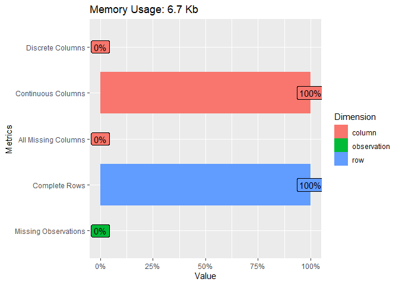
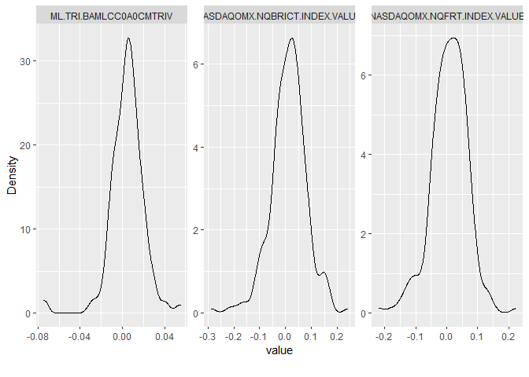
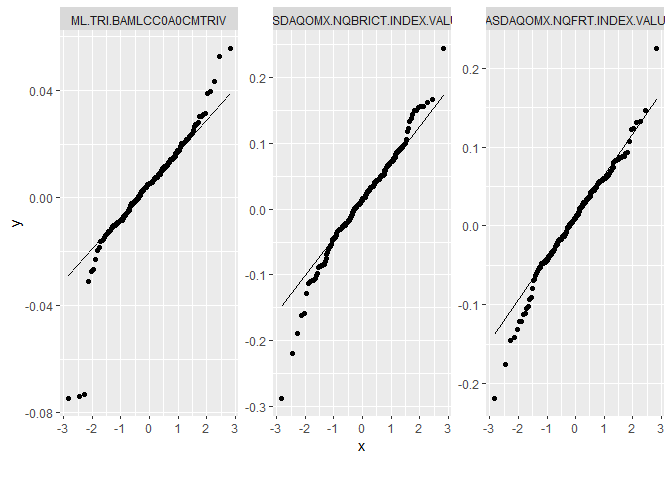
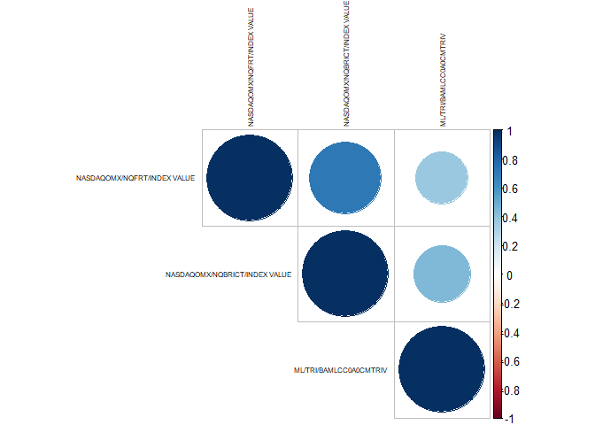
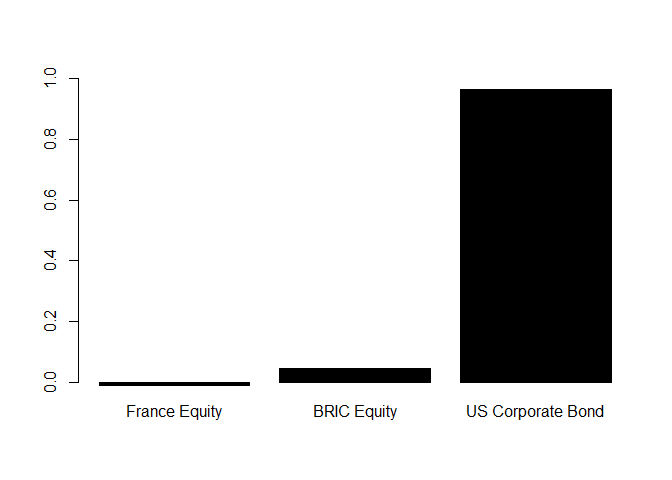
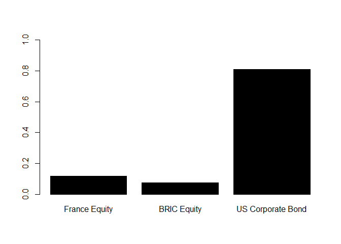

Workshop 2 - Multi-assets tactical allocation, Tangency Portfolio and
Black-Litterman approach
================
Pierre Clauss
October 2023

*The following R Markdown document has to be read with my course notes
(in particular for the details of the analysis framework).*

*Not all the R codes are displayed but only some of them to help you to
succeed the workshop.*

## 1 Data

### 1.1 Importation

I import data in the same way than in the workshop 1.

``` r
library(tidyverse)
library(readxl)
(workshop2 <- read_xlsx("data.xlsx", sheet = "workshop2", skip = 3))
```

    ## # A tibble: 214 × 4
    ##    `TRADE DATE`        `NASDAQOMX/NQFRT/INDEX VALUE` NASDAQOMX/NQBRICT/INDEX V…¹
    ##    <dttm>                                      <dbl>                       <dbl>
    ##  1 2003-10-31 00:00:00                      0.0730                       0.0679 
    ##  2 2003-11-30 00:00:00                      0.0481                       0.0347 
    ##  3 2003-12-31 00:00:00                      0.0864                       0.137  
    ##  4 2004-01-31 00:00:00                     -0.000539                    -0.00188
    ##  5 2004-02-29 00:00:00                      0.0245                       0.0644 
    ##  6 2004-03-31 00:00:00                     -0.0375                       0.0294 
    ##  7 2004-04-30 00:00:00                     -0.0106                      -0.108  
    ##  8 2004-05-31 00:00:00                      0.0251                      -0.0581 
    ##  9 2004-06-30 00:00:00                      0.0313                       0.0179 
    ## 10 2004-07-31 00:00:00                     -0.0319                       0.0102 
    ## # ℹ 204 more rows
    ## # ℹ abbreviated name: ¹​`NASDAQOMX/NQBRICT/INDEX VALUE`
    ## # ℹ 1 more variable: `ML/TRI/BAMLCC0A0CMTRIV` <dbl>

Data are a sample of monthly returns (i) for one part from Nasdaq
observed on 2 equity indexes (France and BRIC) and (ii) for a second
part from Merrill Lynch observed on 1 Bond index (US corporates). The
start date is 31th October 2003 until today.

### 1.2 Wrangling

I need for the workshop only returns to do calculation on: so I shrink
the data of workshop 2 to returns.

``` r
fin_return <- workshop2 %>% select(-"TRADE DATE")
```

Then, the wrangling is quite simple here as for the workshop 1 and is
essentially done via data importation in Excel: data are tidy - each
column is a variable (an index) and each line is an observation (a
month) - and data are transformed in financial returns, which are used
to model a portfolio.

I continue to work on monthly returns because they are nearer to
gaussian data than weekly and daily data.

We can see below, thanks to the package **DataExplorer**, a summary of
the tidy data observed for the 3 variables.

``` r
library(DataExplorer)
plot_intro(fin_return)
```

<!-- -->

I can conclude that data are tidy without missing values.

### 1.3 Visualisation

Data viz has to be thought in relation with modelling. As for workshop
1, I am interested by visualising the distributions of the returns and
the structure of the correlations between them.

Some statistics to sum up the distribution can be shown below: I can
observe symmetric data with a median and a mean which are quite equal.

``` r
summary(fin_return)
```

    ##  NASDAQOMX/NQFRT/INDEX VALUE NASDAQOMX/NQBRICT/INDEX VALUE
    ##  Min.   :-0.219149           Min.   :-0.28792             
    ##  1st Qu.:-0.024142           1st Qu.:-0.02567             
    ##  Median : 0.010216           Median : 0.01471             
    ##  Mean   : 0.008539           Mean   : 0.01170             
    ##  3rd Qu.: 0.046993           3rd Qu.: 0.05085             
    ##  Max.   : 0.225224           Max.   : 0.24392             
    ##  ML/TRI/BAMLCC0A0CMTRIV
    ##  Min.   :-0.074740     
    ##  1st Qu.:-0.003161     
    ##  Median : 0.005300     
    ##  Mean   : 0.004422     
    ##  3rd Qu.: 0.012985     
    ##  Max.   : 0.055541

I can go deeper thanks to distribution graphics: the non-parametric
(kernel method) estimation of the distribution and QQ-plots.

``` r
plot_density(fin_return)
```

<!-- -->

``` r
plot_qq(fin_return)
```

<!-- -->

Finally, I can visualize the correlations between each of the indexes.
To obtain efficient diversification between assets, we need correlations
smaller than 1, which can be observed in the graph below.

``` r
library(corrplot)
corrplot(cor(fin_return), type='upper', tl.col = 'black', tl.cex = 0.5)
```

<!-- -->

## 2 Modelling

Before all, I need to load the package **scales** to communicate with a
pretty way the results of our allocations.

``` r
library(scales)
```

### 2.1 Analysis framework

The analysis framework of our modelling is the Modern Portfolio Theory
initiated by H. Markowitz in the 1950s. An essential portfolio, with the
*Global Minimum Variance* (GMV) portfolio studied in the workshop 1, is
the *Tangency Portfolio* (TP), also named *Maximum Sharpe ratio
portfolio*, for which the weights
 are
equal to :


with 
the covariance matrix between assets returns of length
, with
 the number of assets in
the portfolio,

the vector of the expected excess returns equal to

with  the
expected returns, 
the risk-free rate and 
a vector of  of length
 and finally
.

Contrary to GMV portfolio, we have to estimate also
 with
. Here,
I will present the estimation methodology proposed by F. Black and R.
Litterman (BL) in 1990 and 1992 to estimate
: see [the
following
paper](https://papers.ssrn.com/sol3/papers.cfm?abstract_id=334304) to
demystify this approach and also pages 315-316 of the chapter *Portfolio
Choice Problems* written by M. Brandt in 2010 in the Handbook of
Financial Econometrics.

I then construct a multi-assets allocation with equity, bond and
monetary assets (null weight for this last asset in the TP).

### 2.2 Estimation methodology

Before modelling, I separate the initial sample between a learning
sample and a backtest sample to evaluate the performance of our
modelling. I choose July 2017 as a separation date to backtest the
strategy on the last 2 years of the sample.

``` r
end_date <- nrow(fin_return)
fin_return_learning <- fin_return %>% slice(1:154)
fin_return_backtest <- fin_return %>% slice(155:end_date)
```

There are 154 learning observations and 60 backtest observations. My
objective is to observe if I can obtain better performance with a
tactical allocation on the backtest sample. Before all, I present the
construction of the strategic allocation.

#### 2.2.1 Strategic allocation for the Tangency Portfolio

I begin with classical unbiased estimators for
 and
:


\left(r_t-\hat\mu\right)'")

Then, I can plug-in these estimates on the formula of the TP to obtain
unbiased estimators of its weights. I assume that
.

``` r
n <- ncol(fin_return_learning)
T <- nrow(fin_return_learning)
e <- rep(1, n)
perio <- 12
rf <- 0

mu <- colMeans(fin_return_learning) * perio - rf
Sigma <- cov(fin_return_learning) * (T - 1) / (T - n - 2) * perio
A <- t(e) %*% solve(Sigma) %*% mu
omega <- 1 / as.numeric(A) * solve(Sigma) %*% mu
barnames <- c('France Equity', 'BRIC Equity', 'US Corporate Bond')
barplot(as.numeric(omega), col = 'black', names.arg = barnames, ylim = c(0,1))
```

<!-- -->

The realised return observed on the backtest sample of the portfolio
constructed on the learning sample is equal to 5.12%.

I am going to improve this result thanks to a more robust statistical
approach integrating economic predictions in the allocation.

#### 2.2.2 Tactical allocation for the Tangency Portfolio with Black-Litterman approach

Tactical allocation is a process that deviates the strategic allocation
thanks to new information: for instance, if I think that one index will
perform better in the near future, then I will increase its weight
relative to the others.

Black-Litterman approach is one of a quantitative methodology to
integrate these predictions/views in a relevant way. This approach adds
to economic predictions statistical uncertainty: the econometric
approach is no more a plug-in approach but a decision-bayesian approach.

The Black-Litterman returns are the following mixed estimates:

![\hat\mu\_\text{mixed} = \left\[\left(\tau\hat\Sigma\right)^{-1} + \Omega^{-1}\right\]^{-1} \left\[\left(\tau\hat\Sigma\right)^{-1}\hat\mu + \Omega^{-1}Q\right\]](https://latex.codecogs.com/png.latex?%5Chat%5Cmu_%5Ctext%7Bmixed%7D%20%3D%20%5Cleft%5B%5Cleft%28%5Ctau%5Chat%5CSigma%5Cright%29%5E%7B-1%7D%20%2B%20%5COmega%5E%7B-1%7D%5Cright%5D%5E%7B-1%7D%20%5Cleft%5B%5Cleft%28%5Ctau%5Chat%5CSigma%5Cright%29%5E%7B-1%7D%5Chat%5Cmu%20%2B%20%5COmega%5E%7B-1%7DQ%5Cright%5D "\hat\mu_\text{mixed} = \left[\left(\tau\hat\Sigma\right)^{-1} + \Omega^{-1}\right]^{-1} \left[\left(\tau\hat\Sigma\right)^{-1}\hat\mu + \Omega^{-1}Q\right]")

with  the economic views
quantified by average returns,
 the
confidence parameter in the views and
 the
matrix of uncertainty associated to the economic views; we assume that
 is a
diagonal matrix with diagonal elements equal to variances of assets
returns.

``` r
# Example of parameters for BL approach
mu
```

    ##   NASDAQOMX/NQFRT/INDEX VALUE NASDAQOMX/NQBRICT/INDEX VALUE 
    ##                    0.08858633                    0.15337523 
    ##        ML/TRI/BAMLCC0A0CMTRIV 
    ##                    0.05443125

``` r
Q <- numeric(3)
Q[1] <- 0.30 # positive view for France equity index
Q[2] <- 0.30 # positive view for BRIC equity index
Q[3] <- 0.05 # negative view for US Corporate bonds index
tau <- 0.9
```

``` r
# Mixed estimation of returns
Omega <- diag(diag(Sigma), n, n)
mu_mixed <-
  solve(solve(tau * Sigma) + solve(Omega)) %*% (solve(tau * Sigma) %*% mu +
                                                  solve(Omega) %*% Q)

# Tactical allocation with views directly
A_Q <- t(e) %*% solve(Sigma) %*% Q
omega_Q <- 1 / as.numeric(A_Q) * solve(Sigma) %*% Q
# barplot(as.numeric(omega_Q), col = 'black', names.arg = barnames, ylim = c(0,1))

# Tactical allocation with mixed estimation
A_mixed <- t(e) %*% solve(Sigma) %*% mu_mixed
omega_mixed <- 1 / as.numeric(A_mixed) * solve(Sigma) %*% mu_mixed
barplot(as.numeric(omega_mixed), col = 'black', names.arg = barnames, ylim = c(0,1))
```

<!-- -->

The realised return observed on the backtest sample of the BL portfolio
constructed on the learning sample is equal to 6.42%.

I can compare it to the portfolio constructed directly with views and
without uncertainty on the predictions. The realised return observed on
the backtest sample of this portfolio constructed on the learning sample
is equal to 8.68%. BL approach mitigates the return of this portfolio by
integrating uncertainty and then less confidence in the views.

## To conclude the second workshop

This workshop is the second of my course on Asset Management dedicated
to multi-assets allocation and Tangency Portfolio. I present some
improvements of the classical plug-in estimators thanks to the
Black-Litterman approach.
