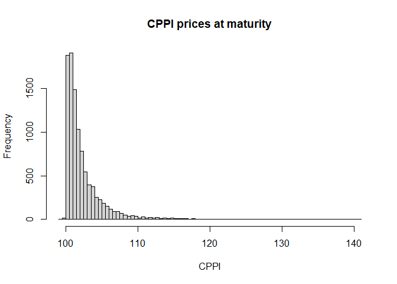

Workshop 3 - Portfolio insurance strategies
================
Pierre Clauss
October 2023

*The following R Markdown document has to be read with my course notes
(in particular for the details of the analysis framework).*

*Not all the R codes are displayed but only some of them to help you to
succeed the workshop.*

## Foreword

There is no data steps in this workshop. I give you the annualised
expected return and volatility of the asset to be insured:
library(tidymodels)


``` r
library(tidyverse)
library(scales)
mu <- 0.05
sigma <- 0.20
```

## 1 Analysis framework

I focus on 2 approaches to insure my capital:

1.  Option-Based Portfolio Insurance with a call
2.  Constant-Proportion Portfolio Insurance

*See my course notes for the details of all the formulas.*

## 2 Simulation methodologies

As I want to simplify the workshop using gaussian simulations, I
simulate monthly returns which could be considered more gaussian than
daily or weekly returns. As an alternative not studied here, we could
use more complex modelling with mixtures of gaussian distributions or
Student distributions family.

The maturity of insurance capital is 1 year.

The other assumptions are:


``` r
delta <- 1 / 12
mat <- 1
rf <- 0.02
strike <- 100
stress <- 0.20
tol <- 0
```

### 2.1 An example with two simulated tracks

The simulation seeds are respectively 1234 and 123.

<!-- -->

<!-- -->

### 2.2 Monte-Carlo simulations

The number of Monte-Carlo simulations is
.

``` r
nsimul <- 10000
```

|    Indicators     | Equity  |  OBPI   |  CPPI   |
|:-----------------:|:-------:|:-------:|:-------:|
| Annualised return | 0.04994 | 0.01999 | 0.02326 |
|    Volatility     | 0.1953  | 0.02631 | 0.02185 |
|  Insurance rate   | 0.5586  |    1    | 0.9983  |

<!-- --><!-- --><!-- -->

## To conclude the third workshop

This workshop is the third of my course on Asset Management dedicated to
structured portfolios with an objective of capital insurance. I present
some tools to insure portfolios and study their risks and performances.
